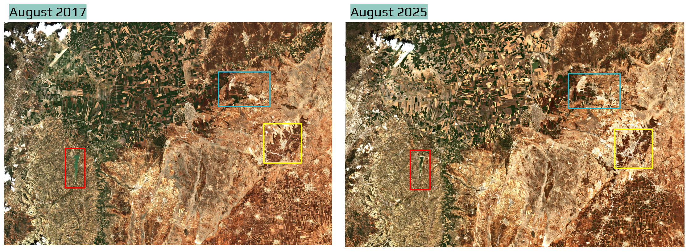
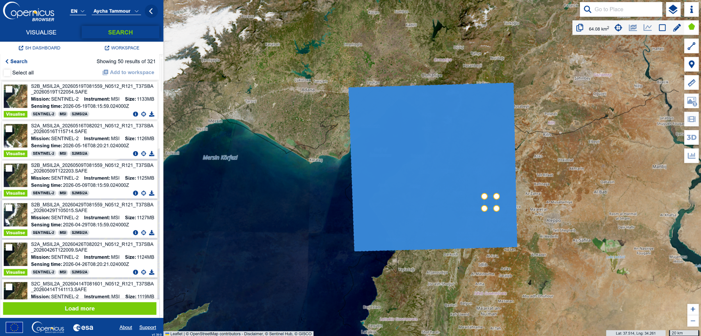
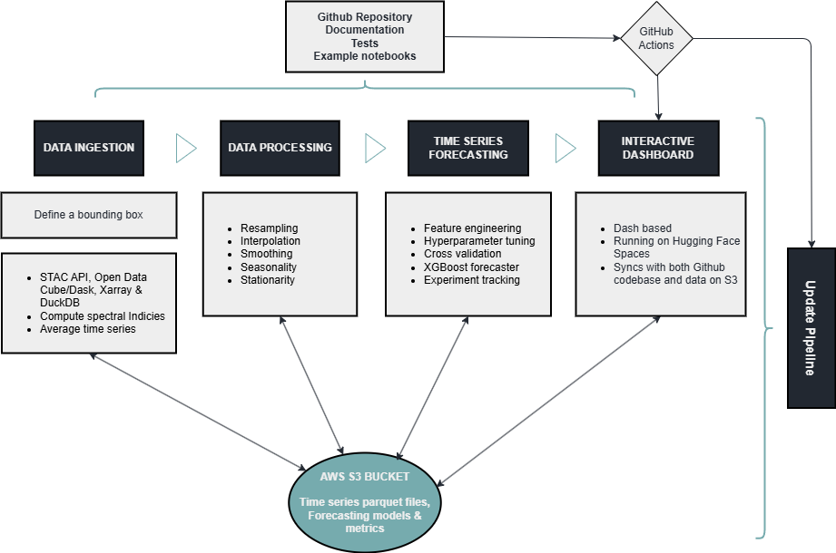
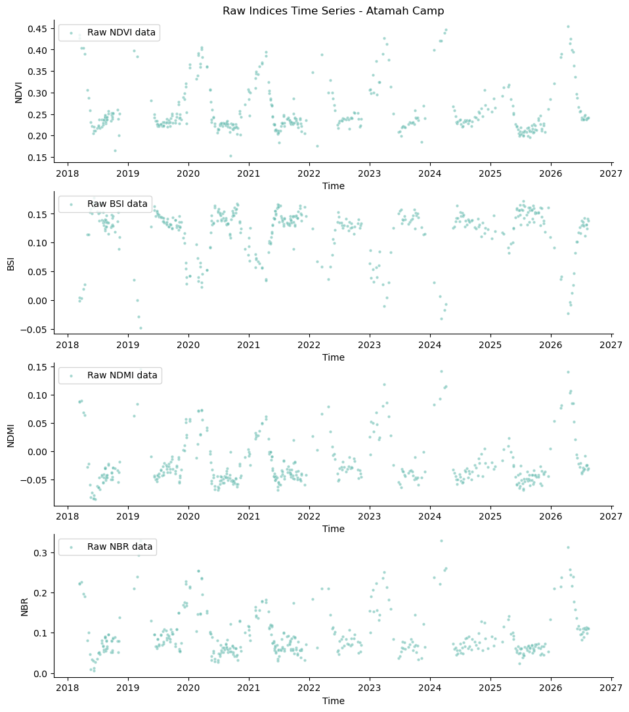
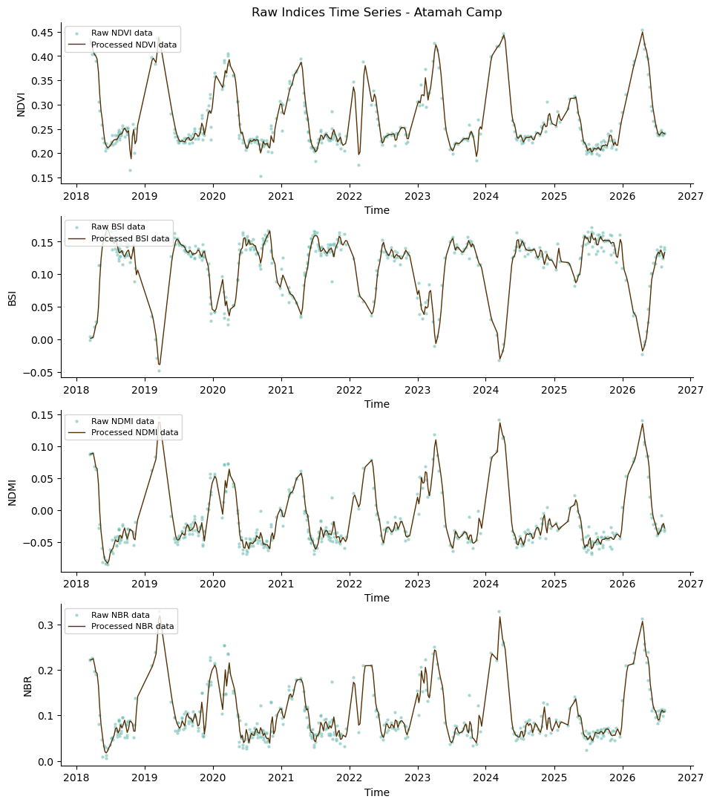
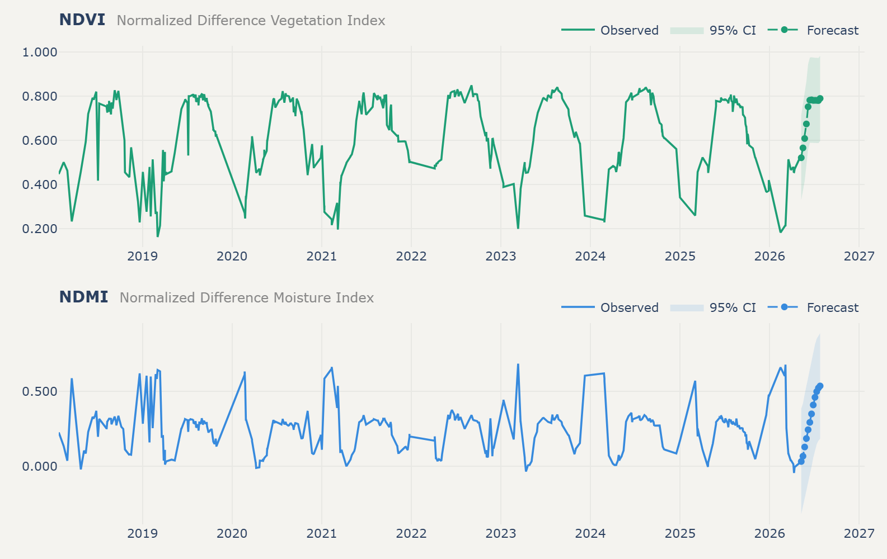
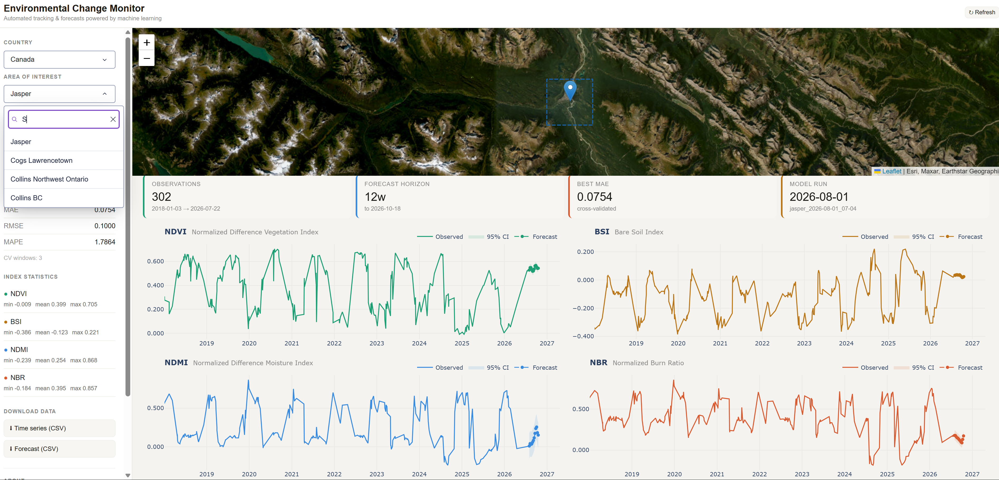

# Environmental Monitoring: An End-to-End Machine Learning Pipeline with Earth Observation Data

*How I built a cloud-native ML pipeline for monitoring and forecasting environmental change without downloading terabytes of satellite imagery*

Monitoring is a critical part of environmental management, and open-source Earth observation (EO) data has made it more accessible than ever. Anyone can pull up a satellite image of almost anywhere on the planet, going back years. The problem is what happens after that: the sheer volume of data makes storage, processing, and analysis genuinely hard to do well, especially if you want to do it more than once. I built a pipeline that automates that process: ingesting new imagery, tracking environmental indicators over time, and forecasting where conditions are headed, for any area of interest, without ever downloading a satellite tile.

We have two Sentinel-2 captures of the same area near Atamah, Syria, eight years apart. The imagery alone shows the change: farmland loss is most visible on the Turkish side of the border, the waterbody has shrunk noticeably, and two refugee camps near Atamah have expanded into what was previously agricultural land. Al-Danah, a nearby town that has absorbed a significant refugee population, has grown visibly over the same period. Has this waterbody shrunk this year only or was it happening gradually over the years? How did the refugee camps impact the farms around the town?

Understanding why requires context the pixels alone can't provide. This is a border region that has absorbed sustained displacement from the conflict in Syria, and the settlement expansion visible here reflects that. It is not a one-off event, but a gradual pressure that has built over years. The pipeline's role is narrower than that story: it can tell you that something changed and roughly when, at the resolution of index averages over an area of interest. It can't tell you why. That's what makes it a monitoring tool rather than an analysis tool: a signal that something warrants a closer look, not a substitute for the on-the-ground knowledge needed to interpret it. 




*Northeast Syria border area with Turkey near the Atamah refugee camp: August 2017 vs August 2025 — Credit: Sentinel-2*

That kind of change is exactly what environmental monitoring is meant to catch, but catching it well means answering a harder question than "can I download a satellite image." It means building a system that keeps answering that question, automatically, efficiently, and indefinitely.

What would be the purpose of such a system, one may ask? Think of it as a tool used by environmental scientists, NGOs, and government agencies to track changes in land cover, vegetation health, water bodies, and other environmental indicators over time.By automatically ingesting new satellite imagery, processing it, and generating forecasts, the pipeline can provide stakeholders with timely information to support decisions about conservation, resource management, and policy. Consider a government agency, NGO, or other organization supporting farmers across a large region. If vegetation or moisture conditions are expected to deteriorate over the next several weeks, knowing that before the deterioration becomes severe could help inform where resources should be directed, which areas might warrant closer assessment, or where agricultural support may be needed.

In this context, the forecast is not the decision itself. It is an additional signal that can feed into a larger resource-allocation, risk-assessment, or early-warning process. And by building it as an extensible pipeline, new areas of interest and spectral indices can be added as needed, without having to re-engineer the whole system. 

## The Challenge

A single Sentinel-2 tile runs about 1 GB on average. For a one-off analysis, that is manageable; download it, crop to the area of interest, run your indices, move on. But for monitoring applications, there are new considerations to take into account. We, for instance, need to go back for new imagery on a schedule, do the reprocessing, and keep results current. And if we are tracking changes in multiple areas of interest, the challenge is now multiplied. Downloading and re-downloading gigabyte tiles does not scale, and neither does a workflow that depends on someone remembering to run it.

For a continuously running monitoring system, that means leaning on automation as much as possible, and designing the system around that from the start, rather than bolting it on afterward.



*Sentinel-2 browser screenshot of the search interface, showing the Atamah, Syria area of interest and the 2017–2025 date range. The STAC API behind this interface is what the pipeline queries to find new imagery without downloading anything locally.*

## Pipeline Design Principles

The pipeline was built around four requirements:

- **Efficient**: in both compute and storage
- **Automated**: runs on a schedule with minimal manual intervention
- **Reproducible**: consistent results across runs and environments
- **Extensible**: easy to add new areas of interest (AOIs) and spectral indices

Here is how those four requirements map onto the actual architecture, end to end:



*The full pipeline: four stages, cloud-native approach to data ingestion, data processing, time series forecasting, and interactive web app. Utilizing AWS S3 storage to write and read data, and GitHub Actions to update the data and the web app on a schedule.*

## Data Ingestion: Cloud-Native

The ingestion stage never downloads a file. Instead, it queries data where it lives:

- A **STAC API** acts as the search index, letting the pipeline query petabytes of Sentinel-2 (or HLS) imagery by location and time, without pulling anything locally
- **Open Data Cube** structures the results into analysis-ready datacubes with consistent coordinates and metadata, allowing us to extract only the pixels we need for the AOI and applying cloud masking and other preprocessing steps
- **Dask** distributes the heavier computation across workers in parallel, and allows us to load the data lazily, so we only touch the pixels we need for the AOI and time range
- **Xarray** gives the pipeline labelled, N-dimensional arrays to extract clean pixel-by-pixel time series across years of imagery

For a defined bounding box, the pipeline computes spectral indices: NDVI (vegetation), BSI (bare soil), NDMI (moisture), NBR (burn ratio), and reduces each scene to an average value. Those averages accumulate into a time series, which gets appended to on every run rather than recomputed from scratch:



*Raw index values for one AOI, 2018–2026. The seasonal cycle is visible immediately in NDVI and NBR — that structure is exactly what the forecasting stage needs to model.*

The result of ingestion is not imagery, it is a handful of parquet files, a few kilobytes each, sitting in S3. That's the efficiency payoff: instead of storing the imagery itself, the pipeline reduces each scene to a handful of summary statistics, resulting in parquet files that are only a few kilobytes each. The schedule updates every two weeks.

## Preprocessing and Forecasting

Once the time series is in S3, the forecasting stage reads it back and prepares it for modeling through resampling, interpolation, and smoothing. Raw indices can be noisy and contain gaps due to cloud masking.



*Processed time series data is now ready for forecasting.*

Forecasting itself runs on **XGBoost** which has a reputation of being fast and robust on structured/tabular data. For this project I use the [Nixtla MLForecast library](https://nixtlaverse.nixtla.io/mlforecast/index.html) which provides a handy scikit-learn like tool to do time series forecasting including feature engineering, and cross validation. Other libraries that I also used include [Optuna](https://optuna.org) for hyperparameter tuning and [MLflow](https://mlflow.org) for experiment tracking.


- **Feature engineering**: this took some experimentation but I mainly used lag features, and rolling windows as well as datetime features (quarter) to capture the seasonal cycles
- **Hyperparameter tuning**: Optuna is a useful tool to help with the search across the hyperparameter space efficiently and systematically
- **Cross-validation**: this step is very important to avoid overfitting and to get a better estimate of the model performance on unseen data. It mainly splits the data into training and validation sets based on time without shuffling the data (remember the temporal order is important here).
I used a time series split with 3 folds, each fold being 12 weeks long.
- **Experiment tracking with MLflow**: logging every parameter, metric, and artifact so the different runs can be compared and the best model can be selected for deployment.

The output is a 12-week-ahead forecast plotted directly against the observed history:



*NDVI and NDMI: eight years of observed seasonal cycles feeding a 12-week forecast.*

The last step is to display the forecast in a web app, along with the historical time series and model metrics, so that users can see the results without needing to run any code.

## The Web App

All of this surfaces in a Dash-based web app, deployed on Hugging Face Spaces, that syncs directly with both the GitHub codebase and the S3 data:



*The live dashboard for Jasper, Alberta — AOI map, pipeline status, model metrics, and all four indices with their forecasts, on a two-week refresh schedule.*

For each AOI, the app shows pipeline status (when the data and model last updated, whether the forecast is ready), model metrics, per-index statistics, and downloadable CSVs for both the historical time series and the forecast. It is currently live for several areas already in Syria, Canada, and other countries. 
And because the pipeline is extensible, adding a new one is mostly a matter of defining a new bounding box.

## Storage and Automation

Everything above is stitched together by a single AWS S3 bucket acting as the shared state between stages, and GitHub Actions handling the scheduling and CI/CD. On a run, the pipeline checks whether an AOI's data is stale, pulls new scenes if so, recomputes indices, retrains the model, and pushes updated results back to S3. This can run either automatically or by triggering the pipeline manually when needed. The following code snippet shows how to run the pipeline for a specific AOI:

```python
from scripts.pipeline import Pipeline

p = Pipeline(country="canada",
            aoi_name='jasper',
            bbox=[-118.1314, 52.8320, -118.0125, 52.9039])

p.run(lat=52.763, lon=-117.979, rad=4000)
```

All the code is available on a GitHub repository with documentation, some tests (should be writing more!), and example notebooks.

## Caveats and Limitations

Given the pipeline reduces the AOI image data to summary statistics to create the average index time series, it is unable to detect small changes that might be lost due to averaging. Such subtle changes can be tracked by using multiple small AOIs or by using spatial information in the model. However, using multiple spectral indices (each measures a different aspect of the environment) could potentially help mitigate this limitation, as it provides a more comprehensive view of the environmental conditions (i.e., water content, build-up, etc.).

Another important limitation to keep in mind is that the forecasts are only as good as the data and the model. The model is trained on historical data, and if there are sudden changes in the environment (e.g., natural disasters, human interventions), the forecasts may not be accurate. Additionally, the model's performance may vary across different AOIs due to differences in environmental conditions, data quality, and other factors. The forecasts should therefore be treated as one source of information rather than a definitive prediction of future conditions.


## Summary and Next Steps

This project is an exercise in bringing data science methods to geospatial data properly; not just running a model once on a downloaded tile, but building a pipeline that is efficient, automated, reproducible, and extensible, and keeping it open-source and open-access throughout.

| Layer               | Tool               | Role                                |
| ------------------- | ------------------ | ----------------------------------- |
| Data discovery      | STAC               | Find imagery without downloading it |
| Data access         | ODC/Xarray         | Load only the required pixels       |
| Parallel processing | Dask               | Scale computation                   |
| Storage             | S3                 | Persist time series and forecasts   |
| Forecasting         | XGBoost/MLForecast | Predict future index values         |
| Experiment tracking | MLflow             | Track model runs                    |
| Automation          | GitHub Actions     | Schedule updates                    |
| Visualization       | Dash               | Serve results                       |


The bigger lessons ended up being less about the modeling and more about the MLOps around it: what is the most efficient way to handle such large volume of data, what happens when there is no new data available for an AOI, what a poor forecast run actually looks like in the metrics before it reaches a user, and how much upkeep it takes to keep AOI information current as new areas get added. None of that shows up in a single slide about model architecture, but it's most of what maintaining an operational ML pipeline actually involves.

Ongoing maintenance, more documentation and tests, and the inevitable bugs are part of the plan, not an afterthought. If there is an area you would like to see added to the monitor, feel free to open an issue on the GitHub repository, and if you want to contribute, please do! The code is open-source and contributions are welcome.

Acknowledgments: This project was completed as part of the COGS GIS-Remote Sensing graduate certificate program.

---

**Links:**
- Live dashboard: [https://aychatammour.com/environmental_monitor_webapp.html](https://aychatammour.com/environmental_monitor_webapp.html)
- GitHub repository: [https://github.com/astroAycha/environment_monitor](https://github.com/astroAycha/environment_monitor)